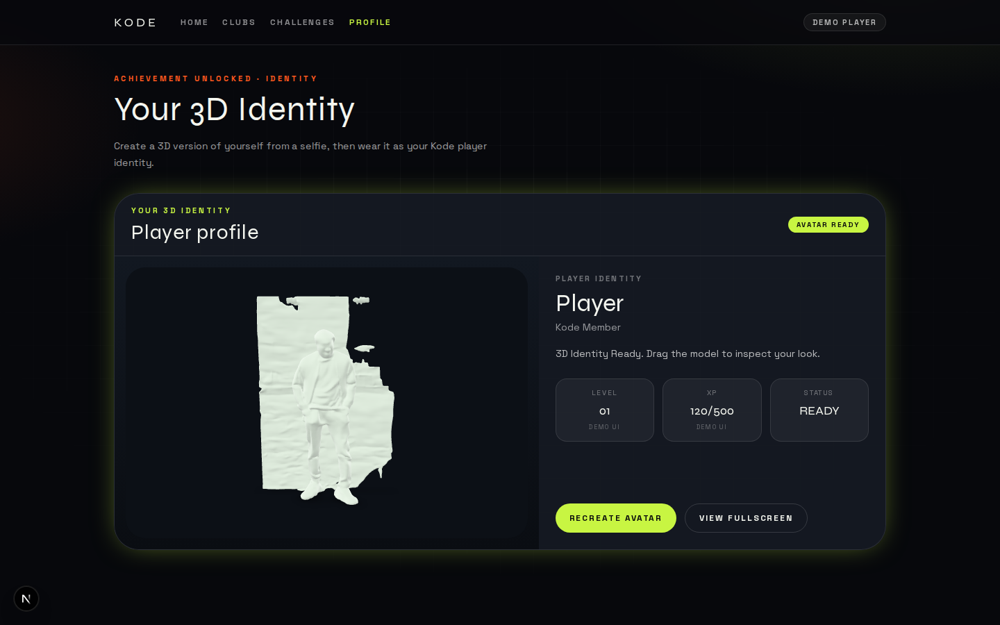
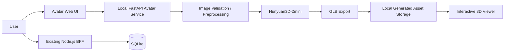
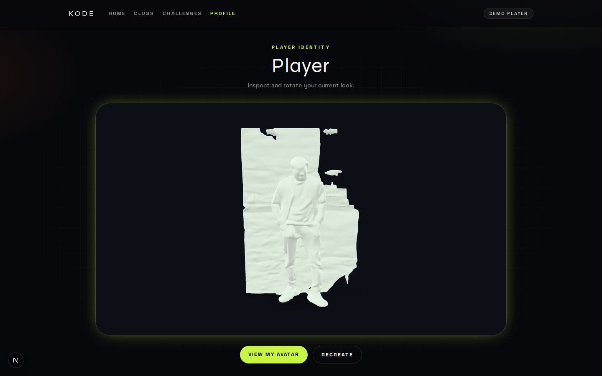
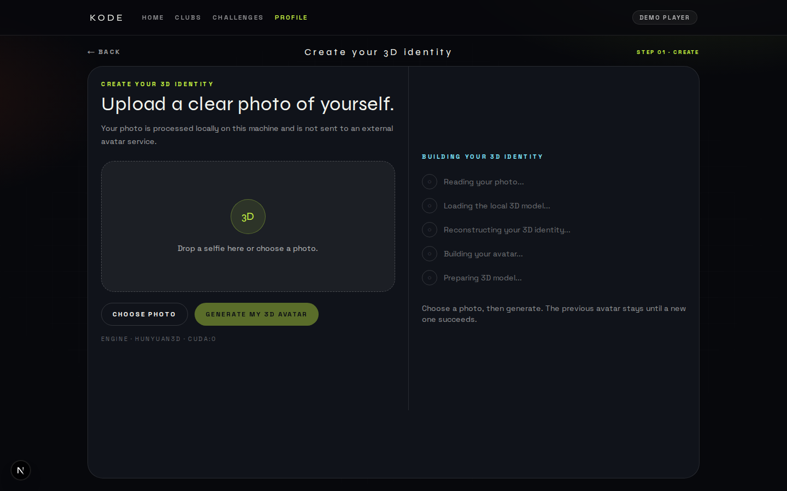

# AI Sana — Local 3D Avatar Generation

**Full-body image → local Hunyuan3D inference → GLB → interactive web viewer**

HackAlem feature branch for a **local** 3D avatar pipeline. A user uploads a full-body image to a machine-local FastAPI service. Hunyuan3D-2mini reconstructs a mesh on the GPU, exports GLB, and the browser renders that file. No hosted avatar SaaS is used for inference.

This branch is isolated from the shared `backend/bff` line of work.

## Demo



A real GLB generated locally from a full-body image using Hunyuan3D-2mini and rendered in the web avatar viewer.

---

## Project Overview

AI Sana already has a Node.js / TypeScript BFF for challenge workflows. This feature adds a **Python sidecar** that turns a full-body photo into a viewable 3D identity:

1. The user provides a full-body image.
2. The image is sent only to a local FastAPI process.
3. Hunyuan3D-2mini runs **on this machine**.
4. The service exports a GLB.
5. The web viewer loads that local URL.

The goal is a privacy-preserving hackathon prototype: inference stays local after model weights are installed.

## What Is Implemented

Confirmed in this repository and validated on a local GPU machine:

- Local full-body image upload (web UI)
- Local image validation (Pillow; JPEG / PNG / WEBP; size and dimension checks)
- FastAPI avatar sidecar (`backend/local-avatar-service/`)
- Local Hunyuan3D-2mini shape inference
- Asynchronous generation jobs
- Job status polling
- Shape-only 3D generation (texture disabled)
- GLB export (`trimesh` / `pygltflib`)
- Local GLB serving (`GET /generated/{filename}`)
- Interactive 3D viewer (`@google/model-viewer` in the validated web UI)
- Recreate flow that keeps the previous avatar until a new job succeeds
- Health endpoint
- Reusable TypeScript helper (`backend/client/avatar.ts`)

## Verified Result

The team validated this end-to-end path:

**Full-body image → local Hunyuan3D-2mini → GLB → FastAPI → web 3D viewer**

Verified environment:

- NVIDIA RTX 4090
- Local inference (`cuda:0`)
- Shape-only generation (untextured mesh)
- Generated GLB ≈ **11.2 MB**
- API: `http://127.0.0.1:8001`
- Viewer used during validation: `http://localhost:3010`

Validation used a full-body test image. The source photo is **not** in this repository.

`GET /health` reported `status: ok`, `backend: hunyuan3d`, and `modelLoaded: true` after the first successful load.

## How It Works

```text
Full-body image
      ↓
Upload UI
      ↓
FastAPI local avatar service
      ↓
Validation / preprocessing
      ↓
Hunyuan3D-2mini
      ↓
3D mesh
      ↓
GLB export
      ↓
Local generated-file endpoint
      ↓
Web 3D viewer
```

Temporary uploads are stored under generated names in `tmp/` and deleted after the job. Only the GLB and metadata remain.

## Architecture

The Python service is a **sidecar**. It does **not** replace the existing Node/TypeScript backend in `backend/src`.



- **Node BFF** (`backend/`): AI Sana challenge API — Express, SQLite, Socket.IO.
- **Avatar sidecar** (`backend/local-avatar-service/`): local 3D generation on port 8001.
- **Web UI**: talks to the sidecar job API and feeds `modelUrl` into `model-viewer`.

## Screenshots

### Generated Avatar Viewer



Fullscreen inspect/rotate view of the locally generated shape-only GLB.

### Local Avatar Creation Flow



Upload UI before a photo is selected. Generation does not start until the user clicks generate. The privacy line states that processing is local.

## Technology Stack

| Layer | Technology |
| --- | --- |
| Existing backend | Node.js 22+, TypeScript, Express, SQLite, Socket.IO |
| Avatar service | Python 3.11, FastAPI, Uvicorn |
| Image validation | Pillow |
| 3D model generation | Hunyuan3D-2mini (`hy3dgen` / `tencent/Hunyuan3D-2mini`) |
| ML runtime | PyTorch + CUDA |
| GPU (validation) | NVIDIA RTX 4090 |
| Mesh / export | trimesh, pygltflib |
| 3D format | GLB / glTF |
| Web viewer | `@google/model-viewer` |
| Model distribution | Hugging Face Hub |
| Frontend helper | `backend/client/avatar.ts` |

OpenAI is used by the **AI Sana challenge BFF**, not by 3D avatar generation.

## API

Avatar sidecar base URL: `http://localhost:8001`

| Method | Path | Purpose |
| --- | --- | --- |
| GET | `/health` | Engine status, backend name, device, `modelLoaded` |
| POST | `/api/avatar/jobs` | Create a generation job (`multipart` `image`, optional `userId`) |
| GET | `/api/avatar/jobs/{jobId}` | Poll status / `modelUrl` |
| POST | `/api/avatar/generate-sync` | Blocking debug helper |
| GET | `/generated/{filename}` | Serve a generated GLB |

Full contract: [docs/local-avatar-api.md](docs/local-avatar-api.md)

## Installation

### Node / AI Sana BFF

```bash
cd backend
npm ci
cp .env.example .env
npm run dev
```

Default BFF: `http://localhost:3001`. This process does **not** generate avatars.

### Local avatar engine

Model weights are **not** in Git. They download into the local Hugging Face cache.

```bash
hf auth login
```

Do not commit the token.

```bash
cd backend/local-avatar-service
python3.11 -m venv .venv
source .venv/bin/activate
pip install torch torchvision --index-url https://download.pytorch.org/whl/cu128
pip install -r requirements.txt

git clone --depth 1 https://github.com/Tencent/Hunyuan3D-2.git vendor/Hunyuan3D-2
pip install -e vendor/Hunyuan3D-2
# Install Hunyuan shape-runtime extras from that repo as needed
# (diffusers, transformers, ...). Skip Gradio/demo extras if possible.
```

Copy `.env.example` if you want local overrides. Default shape checkpoint:

- repo: `tencent/Hunyuan3D-2mini`
- subfolder: `hunyuan3d-dit-v2-mini`

## Running

Avatar service:

```bash
cd backend/local-avatar-service
# activate the Python environment first
uvicorn app.main:app --host 127.0.0.1 --port 8001
```

```bash
curl http://127.0.0.1:8001/health
```

The web viewer used for the verified demo was a local KodeClubs-style Next.js prototype on port **3010**. That UI is not part of this Git tree; this branch ships the sidecar, API docs, and TypeScript client so a teammate can attach any viewer (including `model-viewer`) to `modelUrl`.

## How to Verify

1. Start the local avatar service (`uvicorn` on `127.0.0.1:8001`).
2. Confirm `/health` returns `status: ok` (after first load, `modelLoaded` may become `true`).
3. Open the web upload UI (or call the jobs API with `curl`).
4. Choose a **clear full-body** image. Do not commit that image.
5. Click generate. Do not expect a fake percentage — watch job stages.
6. Poll `GET /api/avatar/jobs/{jobId}` until `completed` or `failed`.
7. Confirm `modelUrl` points at `/generated/avatar-....glb`.
8. Open that URL in `model-viewer` / the profile viewer.

First-time weight download can take a long time. Later jobs reuse the loaded model.

## Local Processing & Privacy

- Avatar inference runs locally on the GPU machine.
- The input image is processed only by the local FastAPI service.
- No Avaturn, MetaPerson, Ready Player Me, or hosted avatar inference API.
- Hugging Face may be used **once** to download official Hunyuan weights.
- Package/model setup can use the network. Inference after that is local.
- Model weights are not committed.
- User source images are not committed.
- Generated user GLBs are gitignored.

## Data and Integrations

- **Input:** user-supplied full-body image (temporary local copy, then deleted).
- **Model:** Hunyuan3D-2mini weights from Hugging Face.
- **Output:** GLB on the local filesystem (`generated/`).
- **UI:** existing web avatar viewer via `modelUrl`.
- **AI Sana BFF:** separate. OpenAI is **not** used to generate the 3D avatar.

## Known Limitations

- Current verified pipeline is **shape-only**.
- The generated avatar is **untextured**.
- No skeletal rigging.
- No animation.
- Hunyuan3D is general image-to-3D, not dedicated biometric / SMPL-X reconstruction.
- Output quality depends on the source image.
- A local CUDA GPU is required for practical speed.
- Initial model download is large (multi-GB).
- Generation is not instantaneous.
- This work lives on an **experimental feature branch**.

## Current Branch

```text
feature/local-avatar-hunyuan
```

The experimental avatar implementation is isolated from the shared `backend/bff` branch. Shared BFF history was restored with a normal revert; this feature branch keeps the avatar code.

```bash
git fetch origin
git switch feature/local-avatar-hunyuan
git pull origin feature/local-avatar-hunyuan
```

## Detailed Documentation

- [Local Avatar Service](backend/local-avatar-service/README.md)
- [Local Avatar API](docs/local-avatar-api.md)
- [AI Sana BFF](backend/README.md)

## Deployment

No public deployment is currently provided. The avatar engine is designed to run locally for the hackathon prototype.
