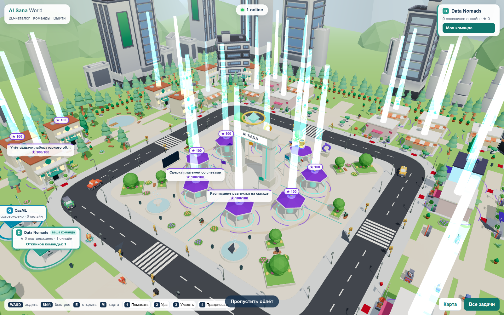
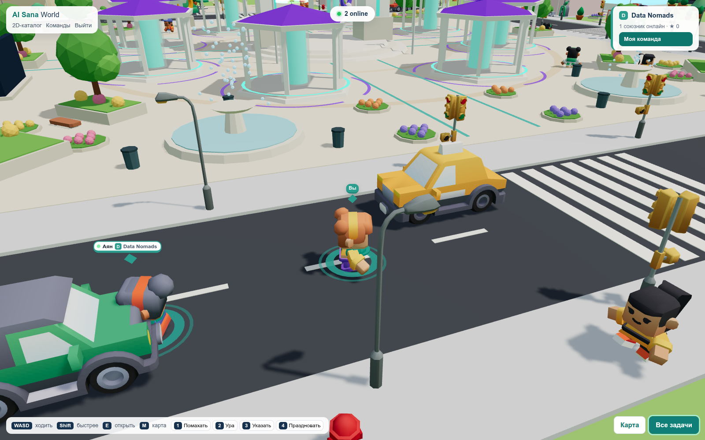
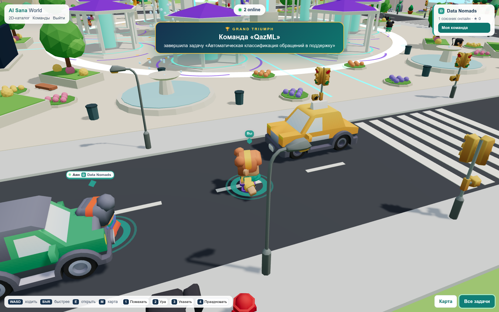
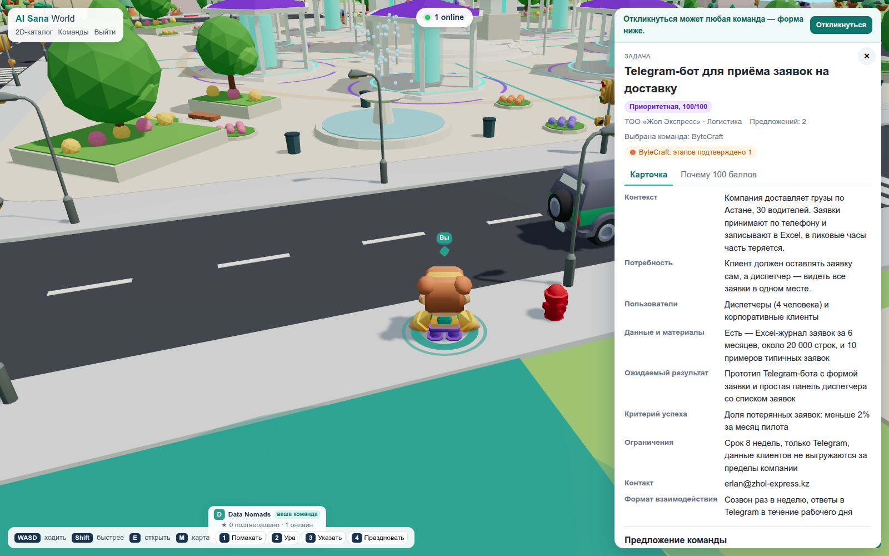
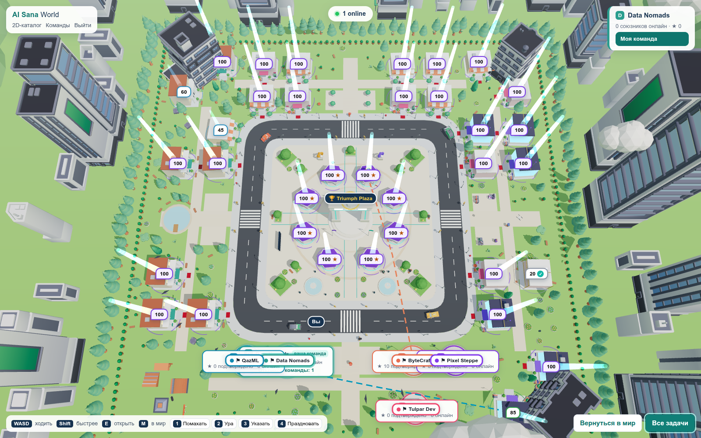

# AI Sana — фронтенд (2D-экраны + мультиплеерный 3D-кампус)

React 19 + TypeScript + Vite 8 + three 0.186 + React Three Fiber 9 + drei 10. Единственный источник данных — BFF из [`../backend`](../backend/README.md) через его типизированный клиент `backend/client/index.ts`.

## Screenshots

Реальные кадры 3D-кампуса (Chromium, 1600×1000). Герой — облёт площади.

### 3D Campus



### Multiplayer



### Grand Triumph event



### Task interaction



### World map



Дополнительно: [игрок на улице](docs/screenshots/player-world.png), [отладка `?debug3d=1`](docs/screenshots/debug-3d.png).

## Запуск
```bash
cd backend && npm ci && cp .env.example .env   # один раз; ключ OpenAI — только в backend/.env
cd ../frontend && npm install
npm run dev:all      # BFF :3001 + Vite :5173 (прокси /api и /socket.io)
```
Открыть http://localhost:5173. Коды входа демо-профилей — в локальном `backend/demo-accounts.local.json` (не в git). Быстрый вход ссылкой: `#/login?code=<код>&name=<имя в мире>`. `npm run bots` — демо-боты (помечены «демо») для показа в одиночку.

| Команда | Что делает |
| --- | --- |
| `npm run dev` / `npm run dev:all` | только Vite / BFF и Vite вместе |
| `npm run build` | проверка типов + сборка `dist/` (раздаётся BFF при `FRONTEND_DIST=../frontend/dist`) |
| `npm test` | планировка мира, коллизии, интерполяция |
| `npm run assets` | копирует выбранные CC0-модели из `assets-raw/` в `public/models/` |

## Экраны
Вход по коду и создание команды · кабинет (бизнес: задачи и следующий шаг; команда: отклики, выбор, этапы) · конструктор (разбор описания с цитатами, уточнения по одному, прогноз и официальный балл, подтверждение, публикация) · сравнение откликов · этап (Git-материалы, решение бизнеса) · каталог · рейтинг · 3D-мир.

## 3D-мир (`src/3d/`)
Triumph Plaza в центре, до 8 главных павильонов (лучшие по готовности), остальные задачи — здания по отрасли на участках, место по `seed = hash(task.id)`; базы команд, карта (M), эмоции 1–4, idle-действия, NPC, машины, птицы, дрон; GRAND TRIUMPH — только по серверному `world.triumph` после подтверждения этапа бизнесом. Присутствие игроков — Socket.IO BFF (`backend/src/world.ts`), 12 Гц с интерполяцией; имя участника — только для таблички (в BFF у команды один общий код). Отладка: `#/world?debug3d=1`.

Модели — CC0: Kenney City Kit (Commercial), Car Kit, Mini (characters/forest/market/arcade/skate/trophy), KayKit City Builder Bits; лицензии — `public/models/LICENSES.txt`.

Проверено 2026-09-23 в браузере: сцена рисуется, WASD и карта `M` работают, два клиента видят друг друга, карточка задачи открывается, GRAND TRIUMPH пойман после подтверждения этапа бизнесом. В `?debug3d=1` в той сессии был FPS 60. Не утверждается стабильный 60 FPS на любом железе; визуально отчётливая синхронизация эмоций 1–4 не зафиксирована.
